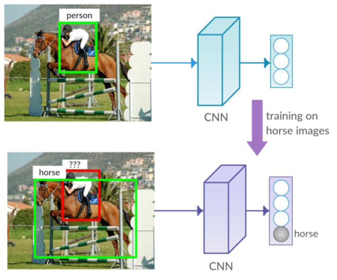
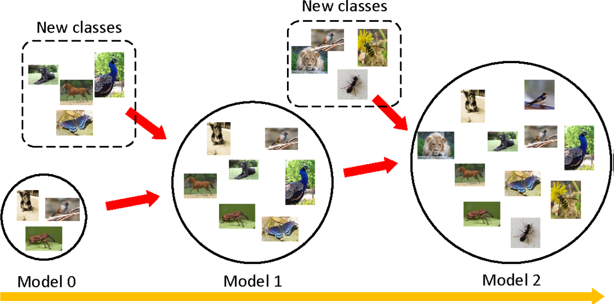
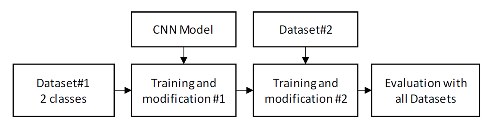
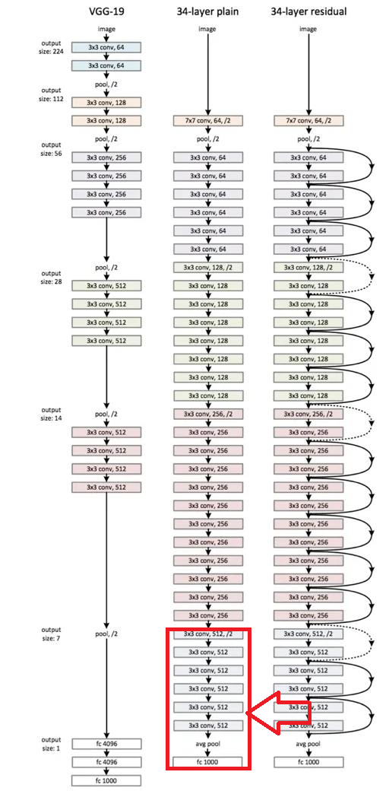
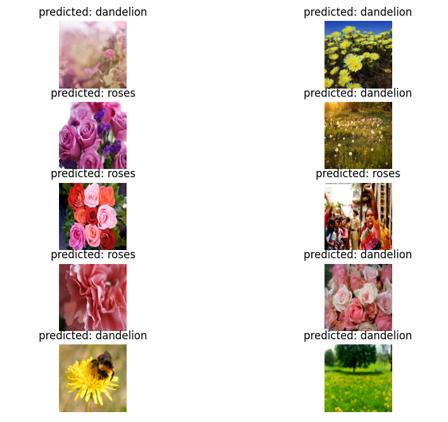
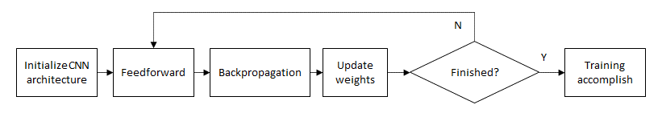
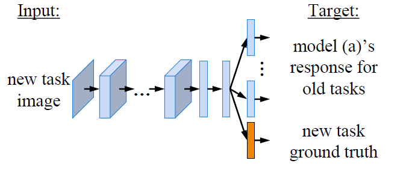
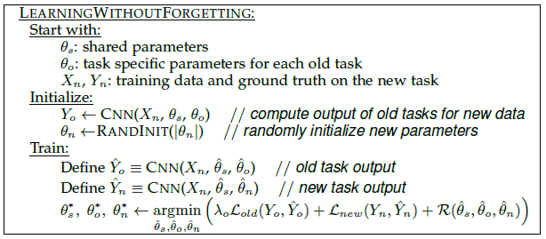

# Autonomous-Object-Training-and-Detection-System-with-Convolutional-Neural-Networks

This repository is a part of my Master thesis in Frankfurt University of Applied Sciences, Frankfurt am Main, Germany. 

The thesis aims to demonstrate the solution to the problem known as "Catastrophic Forgetting" when training Convolutional Neural Networks (CNNs). 

Figure.:1.  Catastrohic Forgetting (K Shmelkov et al.,  2017)

The solution to the problem is called "Incremental Learning", which the model could be retrained with new classes and still be able to recognise old classes as Figure.:2.

Figure.:2.  Incremental Learning (Singh, 2019)

## Experiment

In this repository, I selected one well-known technique, "Learning-without-Forgetting" to demonstrate incremental learning with flower dataset. The experiment consists of the following
1.  dataset preparation
2.  experiment-phase-1
3.  experiment-phase-2

The flowchart diagram below shows how I experimented LwF technique with flower dataset.

Figure 3:  Experiment Flowchart diagram

1.  Dataset preparation 
In the experiment, flower dataset from kaggle was used. The dataset can be found at [kaggle-website](https://www.kaggle.com/datasets/imsparsh/flowers-dataset). The dataset folder then was structured as followed.

Flower dataset contains 5 types of flowers with 924 images each. In the experiment, only 4 types of flowers were used and re-structured as Dataset#1 and Dataset#2.

<b><u>Dataset #1</u></b> 
Flower_Dataset_1 
├── Train 
│ ├── Dandelion 
│ │ ├── dandelion1.jpg 
│ │ ├── dandelion2.jpg 
│ │ ├── dandelion3.jpg 
│ │ ├── dandelion4.jpg 
│ │ ├── ... 
│ └── Roses 
│ ├── rose1.jpg 
│ ├── rose2.jpg 
│ ├── rose3.jpg 
│ ├── rose4.jpg 
│ ├── ... 
└── Validation 
&ensp;&ensp;├── Dandelion 
&ensp;&ensp;│ ├── dandelion1_val.jpg 
&ensp;&ensp;│ ├── dandelion2_val.jpg 
&ensp;&ensp;│ ├── dandelion3_val.jpg 
&ensp;&ensp;│ ├── dandelion4_val.jpg 
&ensp;&ensp;│ ├── ... 
&ensp;&ensp;└── Roses 
&ensp;&ensp;├── rose1_val.jpg 
&ensp;&ensp;├── rose2_val.jpg 
&ensp;&ensp;├── rose3_val.jpg 
&ensp;&ensp;├── rose4_val.jpg 
&ensp;&ensp;├── ... 

<b><u>Dataset#2</u></b> 
Flower_Dataset_2 
├── Train/
│ ├── Sunflowers 
│ │ ├── sunflower1.jpg 
│ │ ├── sunflower2.jpg 
│ │ ├── sunflower3.jpg 
│ │ ├── sunflower4.jpg 
│ │ ├── ... 
│ └── Tulips 
│ ├── tulip1.jpg 
│ ├── tulip2.jpg 
│ ├── tulip3.jpg 
│ ├── tulip4.jpg 
│ ├── ... 
└── Validation 
&ensp;&ensp;├── Sunflowers  
&ensp;&ensp;│ ├── dandelion1_val.jpg 
&ensp;&ensp;│ ├── dandelion2_val.jpg 
&ensp;&ensp;│ ├── dandelion3_val.jpg 
&ensp;&ensp;│ ├── dandelion4_val.jpg 
&ensp;&ensp;│ ├── ... 
&ensp;&ensp;└── Tulips  
&ensp;&ensp;├── tulip 1_val.jpg 
&ensp;&ensp;├── tulip 2_val.jpg 
&ensp;&ensp;├── tulip 3_val.jpg 
&ensp;&ensp;├── tulip 4_val.jpg 

2.  Experiment-phase-1  
In this phase, the selected model ResNet34 will be modified and trained with dataset#1 train set. Then the accury of the model is evaluated with the test set.

The pretrained ResNet34 CNN model was selected as the base model for this experiment. Pretrained ResNet34 model holds the weights from ImageNet dataset with 1,000 image classes.

The experiment requires the modification of the fully-connected (fc) layer. Instead of 1,000 nodes, the fc layer is replaced with fc layer with 2 nodes, since our first dataset#1 has only 2 classes. 

Figure 4:  ResNet34 model (Red box indicates the modified part)

The modified ResNet34 model is then trained with dataset#1 train set and then evaluate the accuracy from dataset#1 test set. The accuracy is 87.9%.

Figure 5:  Evaluation result for trained model

3.  Experiment-phase-2
In this phase, the trained model will be modified and then re-trained again to try to achieve the incremental-learning with dataset#2.

The trained ResNet34's fc layer is then modified to support 4 classes as the same way it was done in 2. The training process is the same.

As the evaluation was done the same way with 2., unfortunately, the re-trained ResNet34 model could not achieve the goal of the experiment. The accuracy from testing the re-trained model with dataset#1 test set is 1.16%, and with dataset#2 test set is 46.64%. The low percentage of accuracy indicates the model fail to recognise both dataset#1 and dataset#2. 

Figure 6:  Evaluation result for re-trained model

## Training process

The section describes how does the training work and which parameters was set during training. The CNN model training was done using [pytorch libraries](https://pytorch.org/). The below flowchart diagram shows the flowchart diagram for training.

Figure 7: Training flow in CNNs (Adapted from: Wang et al., 2019)

###  Feedforward

The feedforward process in a Convolutional Neural Network (CNN) refers to the procedure of passing an input through the network to generate an output prediction.

Suppose a network has 𝐿 layers, each defined by a weight matrix 𝑊(𝑙), a bias vector 𝑏(𝑙), and an activation func-tion 𝑓(𝑙), for 𝑙=1,…,𝐿. Given an input vector 𝑋(0), the feedforward process is calculated as follows:

For each 𝑙=1,…,𝐿, compute the pre-activation 𝑧(𝑙) and the post-activation (output) 𝑋(𝑙) as: 

$𝑧(𝑙)=𝑊(𝑙)𝑋(𝑙−1)+𝑏(𝑙) $ 

$𝑋(𝑙)=𝑓(𝑙)(𝑧(𝑙))$

Here, 𝑋(𝑙−1) is the output of the previous layer (or the input for the first hidden layer), 𝑊(𝑙) is the weight matrix at layer 𝑙, and 𝑏(𝑙) is the bias vector at layer 𝑙. The function 𝑓(𝑙) is the activation function at layer 𝑙, which intro-duces non-linearity into the model and enables it to learn more complex representations (Rumelhart et al., 1986).

The final output 𝑋(𝐿) of the network is the prediction made based on the input 𝑋(0) (Rumelhart et al., 1986).

###  Backpropagration

Let’s consider a network with 𝐿 layers, each defined by a weight matrix 𝑊(𝑙), a bias vector 𝑏(𝑙), for 𝑙=1,…,𝐿. Given an input vector 𝑋(0) and the corresponding target 𝑦, the network produces a prediction 𝑋(𝐿) through the feedforward process. The loss function 𝐿 measures the difference between the prediction and the target.

The key quantity computed in backpropagation is the gradient of the loss with respect to the pre-activations 𝑧(𝑙), denoted by 𝛿(𝑙). This quantity is computed recursively starting from the final layer 𝐿 as follows:
For 𝑙=𝐿,𝛿(𝐿)= ∇𝑧(𝐿)𝐿, the gradient of the loss with respect to the pre-activation at the output layer.
For 𝑙=𝐿−1,…,1, 

$δ(𝑙)=((𝑊(𝑙+1))𝑇 δ(𝑙+1))⊙𝑓′(𝑙)(𝑧(𝑙))$

where ⊙ denotes the element-wise product and 𝑓′(𝑙) is the derivative of the activation function at layer 𝑙 (Rumelhart et al., 1986).

Once the 𝛿(𝑙) are computed, the gradient of the loss with respect to the parameters can be easily obtained as:

$∇W(𝑙)𝐿=δ(𝑙) (X(l−1))T $  
$∇b(𝑙)𝐿=δ(𝑙)$

These gradients are used to update the weights and biases during the learning process (Rumelhart et al., 1986).

###  Optimization

In Momentum SGD, an additional velocity term 𝑣𝑡 is introduced. The update rule becomes a two-step process:
1. Update the velocity: 𝑣𝑡=𝜇𝑣𝑡−1−𝜂∇𝐿(𝑤𝑡−1)
2. Update the parameters: 𝑤𝑡=𝑤𝑡−1+𝑣𝑡
Here, 𝜇 is the momentum coefficient which determines the contribution of the previous velocity to the current one. This velocity term, effectively a running average of the gradients, allows the algorithm to gain speed along directions where the gradient is consistently pointing towards, thus accelerating convergence and reducing oscil-lations (Sutskever et al., 2013).

### Loss function

In the context of training a machine learning model, the loss function, also known as the cost function or objec-tive function, is used to measure the disparity between the model's predictions and the actual data. Mathematical-ly, for a given set of model parameters, denoted by 𝜃, and a dataset {𝑥𝑖,𝑦𝑖}, the loss function 𝐿(𝜃) quantifies the error of the predictions.
One of the most common loss functions is the Mean Squared Error (MSE) which is often used in regression problems. Given 𝑁 instances in the dataset, the MSE loss function is defined as: 

$𝐿(θ)= (1𝑁)Σ(𝑦𝑖− 𝑓(𝑥𝑖,θ))2𝑖$

Where 𝑦𝑖 is the actual value, 𝑓(𝑥𝑖,𝜃) is the model's prediction for instance 𝑥𝑖, and the square ensures that larger errors are penalized more heavily.
In classification problems, Cross-Entropy Loss, also known as log loss, is often used. It measures the dissimilari-ty between the actual probability distribution (𝑦𝑖) and the predicted distribution (𝑓(𝑥𝑖,𝜃)). For binary classifica-tion, it is defined as: 

$𝐿(θ)= −(1𝑁)Σ[𝑦𝑖𝑙𝑜𝑔(𝑓(𝑥𝑖,θ))+ (1−𝑦𝑖)𝑙𝑜𝑔(1 − 𝑓(𝑥𝑖,θ))]𝑖$

The choice of loss function depends on the specific problem and the nature of the data. The objective during the training process is to find the model parameters θ that minimize this loss function (Goodfellow et al., 2016).

#### LwF loss function

LwF (Learning without Forgetting) is a loss function designed to combat catastrophic forgetting in deep neural networks. It incorporates distillation to transfer knowledge from old tasks to new ones. The LwF loss function comprises a classification loss and a distillation loss. The former measures the difference between predicted probabilities and ground truth labels, guiding accurate learning of the new task. The latter maintains knowledge of the old task by comparing predicted probabilities using previous parameters. The LwF loss function is a combination of these two losses with a temperature parameter to control their influence. It was introduced by Li and Hoiem in their 2016 paper, "Learning without Forgetting," presented at the European Conference on Computer Vision (ECCV) (Li, Z., & Hoiem, 2016).

Equation:

$LwF Loss = Classification Loss + DistillationLoss$

Figure 8: LwF Model Structure (Li & Hoiem, 2016)

The following figure 9 shows the algorithm used in LwF.

Figure 9: LwF's algorithm (Li & Hoiem, 2016)

